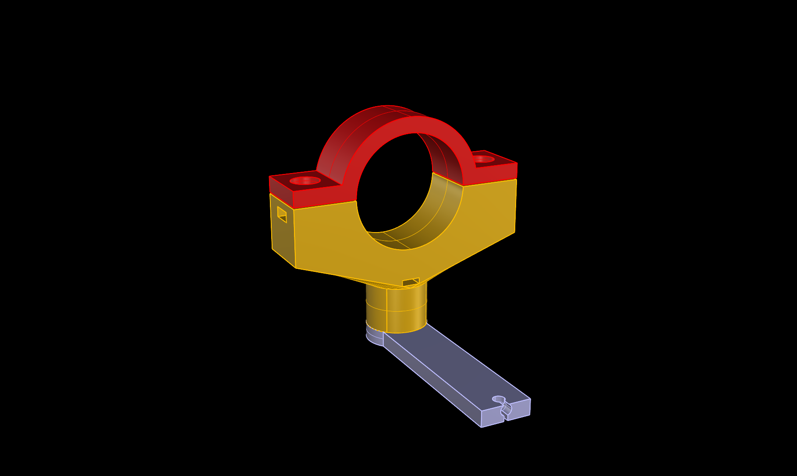
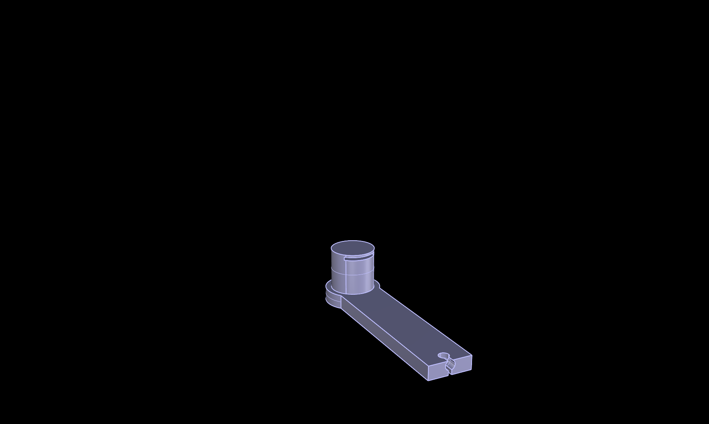
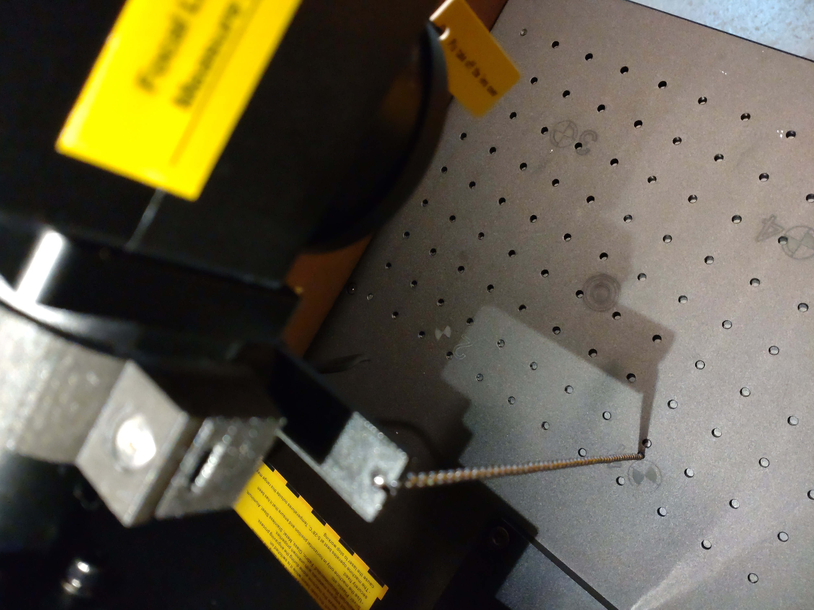
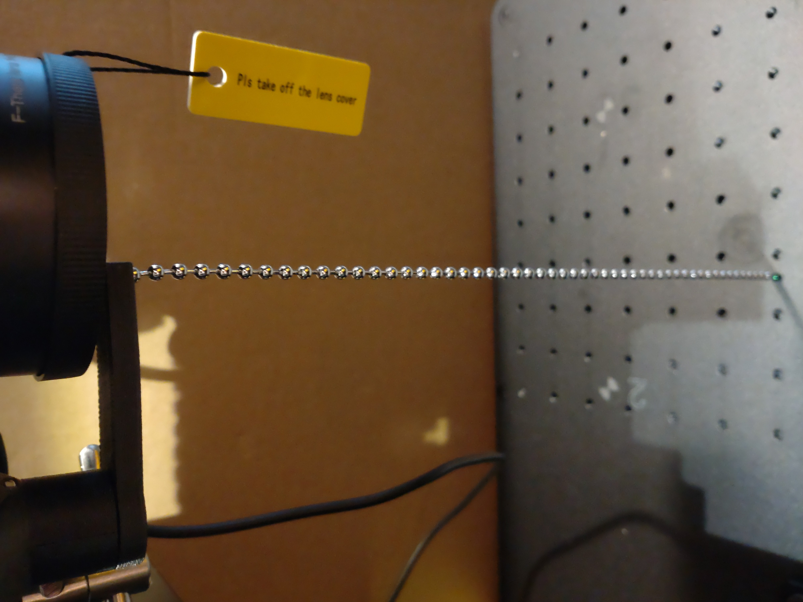

# Magnetic focus distance holder 
In a video from youtuber ebpman about the ComMarker Omni 1, i saw a nice distance measurement tool consisting of 2 parts, 
a chain with a defined length of the Laser focus point mounted on a magnetic chain holder and a mount-fixture. 
I found this tool so usefull that i created my own one for the ComMarker Omni 1 (10 W). It consists of 3 parts. 
The mount piece consists of 2 3D printed parts (top and bottom part, mounted on a pipe), the 3D printed magnetic movable arm with a ball chain.

## View

 
 

 
 

